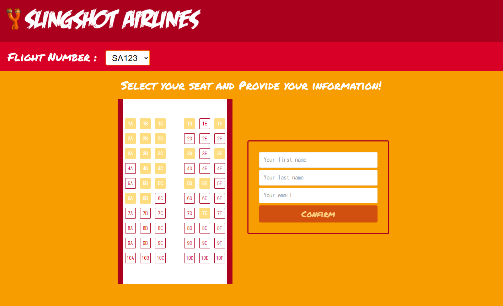
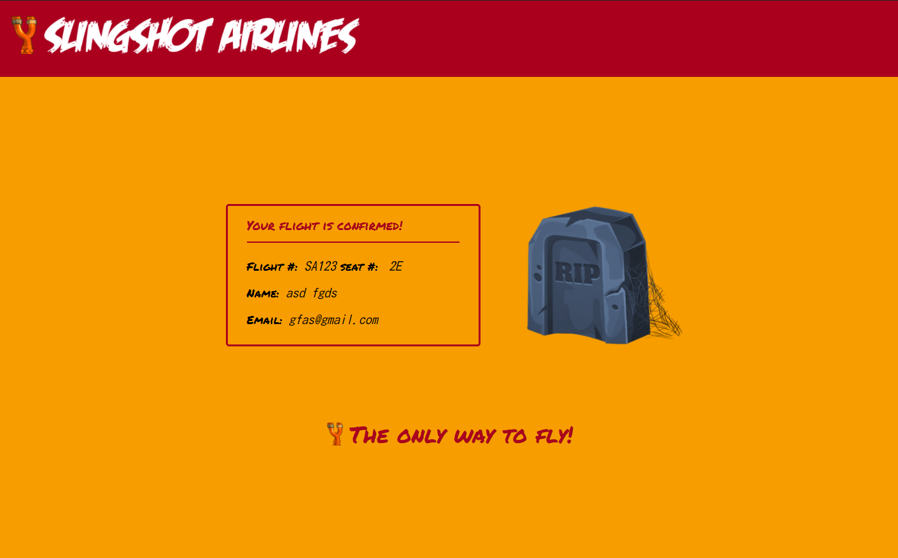
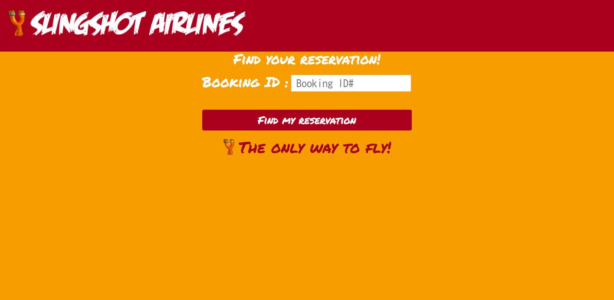

# Slingshot Airlines Node.js Project

## Description

A small project using HTML, CSS, Javascript, and most importantly, Node.JS. This app is a flight booking simulator which will let you see different flights' availabilities, book a seat on a flight, and see your booking confirmation page.

## Features

### Flight View

A page to view any flight and see which seats are available. You can then fill out your information and attempt to book the seat!

### Confirmation Page

After booking, you are redirected to this page, which shows all the info you need for your flight!

### Reservation look-up

Upon entering your booking ID, you will be redirected to your confirmation page to view all the info you need!
